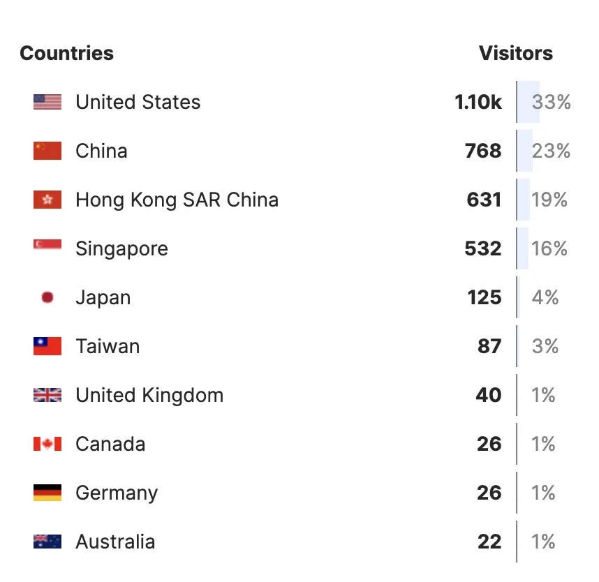

# Understanding Internet Basics for Cross-Border E-Commerce: IP, Domains, Servers, and Network Performance

---

For cross-border sellers and e-commerce professionals, grasping how IP addresses, domain names, and servers work together isn't just technical knowledge—it's the foundation for delivering faster page loads, smoother customer experiences, and more effective ad campaigns. Whether you're setting up a Shopify store or troubleshooting DNS records, understanding these concepts helps you make smarter hosting decisions and avoid costly delays.

---

## Getting Started with Your Online Store

Most people running a cross-border business on Shopify need to complete two basic steps:

1. Create a Shopify store (you can start with Shopify's trial offer)
2. Register a domain name, verify the DNS records are working, then connect it to your Shopify site

Once that's done, customers can type your domain into their browser and land right on your store.

Sounds simple enough. But when something goes wrong—like needing to verify a different DNS record—many people get stuck because they don't understand what's actually happening behind the scenes.

## A Simple Analogy

Finding the perfect analogy for domains, IPs, and servers is tricky. But here's one that clicks for most people.

Think about phone numbers. You probably remember the numbers of your closest friends and family by heart. But your cousin twice removed? Not a chance. You rely on your phone's contact list to look them up by name instead of memorizing every digit.

That's exactly how domains and IP addresses work. The IP address is like the phone number—necessary but hard to remember. The domain name is like the contact name—easy to recall and type. When you search for "John Smith" in your contacts, your phone finds the number. When you type a domain into your browser, the DNS system finds the IP address.

**The comparison breaks down like this:**
- Remembering someone's phone number takes effort; remembering their name is natural
- Accessing websites by IP is clunky; using domain names is effortless

As for servers? They're the invisible infrastructure hosting your website, similar to the cellular networks that make phone calls possible.

## Network Performance and Speed

Now that we've covered IPs, domains, and servers, let's talk about what actually affects your experience online.

When people hear "speed," they usually think of download rates. But for cross-border e-commerce, network latency and page load times matter just as much—sometimes more.

Whether you're running Facebook ads, managing Instagram campaigns, or using proxies to access international platforms, these factors directly impact your efficiency and results.

If you're serious about optimizing your cross-border operations and need reliable infrastructure that performs well across multiple regions, you might want to explore solutions specifically designed for international connectivity. For sellers who rely on consistent access to overseas platforms, having the right network setup can make or break your daily workflow. 👉 [Check out proven infrastructure solutions that help cross-border businesses maintain fast, stable connections worldwide](https://www.dmit.io/aff.php?aff=13832)

### Building Your Own Website

Let's say you're setting up a website—whether it's for selling products or hosting a blog. Your first priority should be visitor experience.

If most of your traffic comes from the United States, choose a US-based server. Shorter transmission distance means faster loading speeds. Pretty straightforward.

But what if your customers are scattered across North America, Europe, and Oceania? Then you need to think about CDN (Content Delivery Network) solutions—or just use Shopify, which includes CDN by default.

Data analysis helps you make these decisions. Here's a snapshot of my blog's visitor data over a recent period:

Even though my blog focuses on Shopify tutorials in Chinese, the top traffic source isn't mainland China—it's the United States. Combined, US and Hong Kong visitors account for over 50% of total traffic, while mainland China represents less than a quarter.

Here's another example. When you visit the premium tutorials or free guides on my blog, you'll see cover images. Originally, I linked directly to Unsplash for these images. Then I discovered that Unsplash servers were blocked in China, making the images appear broken for mainland visitors. So I downloaded and re-hosted them on my own server. Now everyone can see them properly, regardless of location.

I've made plenty of other optimizations to improve user experience on that tutorial site, but they're beyond the scope of this article and not directly relevant to today's topic.

The point is this: if you want maximum efficiency in your work and the best possible online experience, you need to consider your internet service provider and network routing quality. For cross-border professionals who depend on accessing international platforms daily, network stability isn't optional—it's essential. The right infrastructure setup ensures you're not fighting against lag, timeouts, or blocked connections when you're trying to get work done. 👉 [Discover network solutions built specifically for reliable international access](https://www.dmit.io/aff.php?aff=13832)

---

## Wrapping Up

Understanding how IP addresses, domains, and servers interact isn't just technical trivia—it directly affects your store's performance, customer experience, and your ability to run effective marketing campaigns. Choose servers close to your target audience, consider CDN for global reach, and pay attention to network quality when accessing international platforms. These fundamentals make the difference between a smooth operation and constant headaches. For cross-border sellers who need dependable infrastructure that performs consistently across regions, investing in the right hosting and network solutions pays off in faster load times and fewer disruptions.
